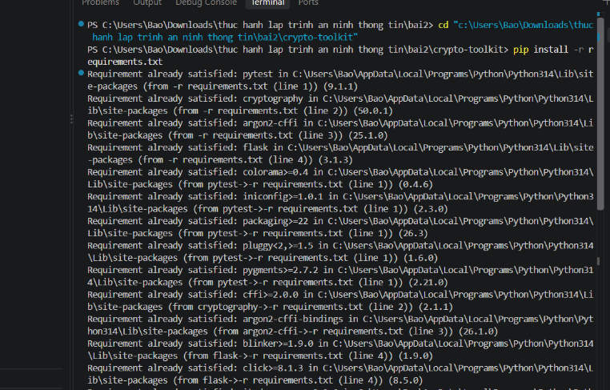
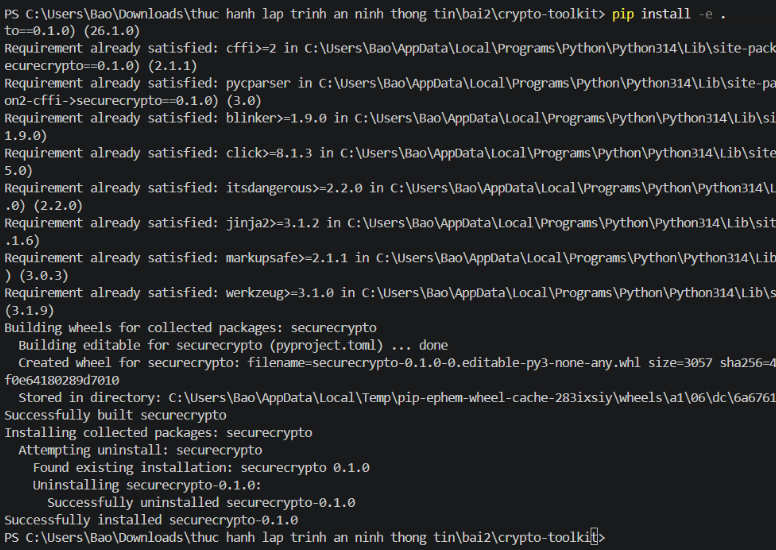
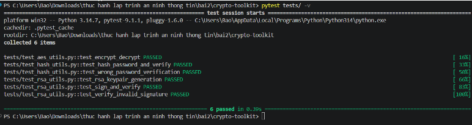
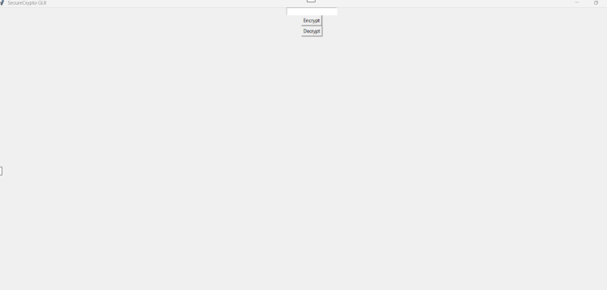
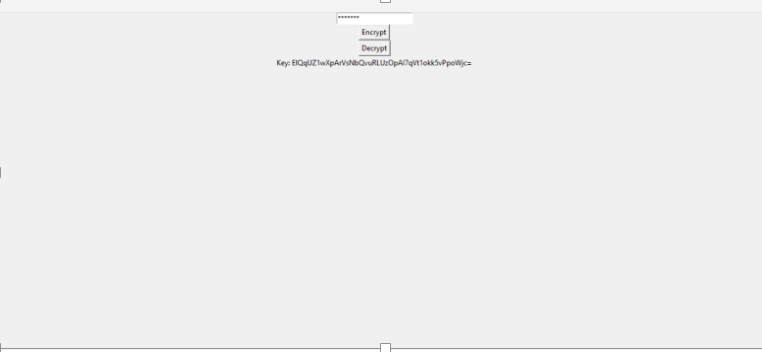
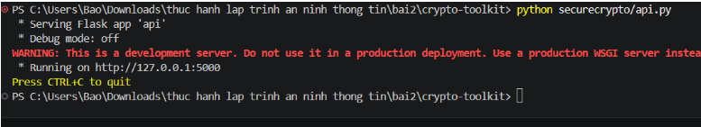
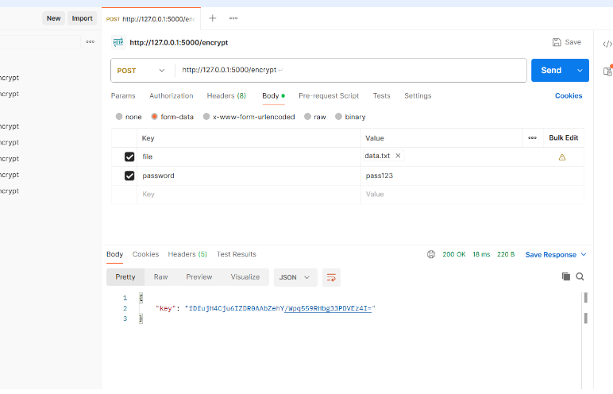
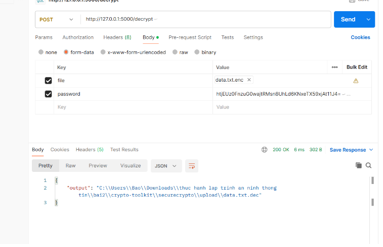
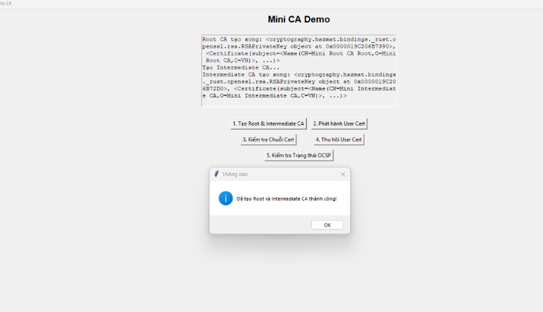

# TRƯỜNG ĐẠI HỌC CÔNG NGHỆ TP HCM

## KHOA CÔNG NGHỆ THÔNG TIN

### Môn: Thực hành Lập trình an ninh thông tin

---

# BÁO CÁO

- **Họ Và Tên:** Phan Gia Bảo
- **MSSV:** 2380600167
- **Lớp:** 23DATA1

---

## NỘI DUNG THỰC HÀNH

Cài đặt thư viện cho crypto-toolkit — các thư viện đã được cài sẵn (cryptography, flask, pycryptodome, pytest)

---

Cài đặt package securecrypto ở chế độ editable (pip install -e .)

---

Chạy pytest kiểm thử tự động 6 test cases đều PASSED: kiểm tra mã hóa/giải mã AES, hash mật khẩu, xác thực hash sai, tạo cặp khóa RSA, ký và xác thực chữ ký RSA

---

Giao diện đồ họa của crypto-toolkit

---

Mã hóa file data.txt qua GUI — nhập mật khẩu, chọn file, kết quả hiển thị key base64

---

Khởi chạy dịch vụ Flask API trên cổng 5000 (http://127.0.0.1:5000) cung cấp các endpoint mã hóa và giải mã qua HTTP.

---

Kiểm thử API /encrypt qua Postman bằng phương thức POST form-data — nhận mã trạng thái 200 OK và chuỗi khóa Base64 trả về.

---

Kiểm thử API /decrypt qua Postman — giải mã thành công file đã tải lên và xuất ra file data.txt.dec.

---

Giao diện trực quan Mini CA Demo UI. Khi người dùng bấm nút "1. Tạo Root & Intermediate CA", ứng dụng tự động khởi tạo cặp khóa RSA 2048-bit và tạo thành công 2 cấp CA với popup xác nhận "Đã tạo Root và Intermediate CA thành công!", chứng minh hệ thống CA đã sẵn sàng vận hành
