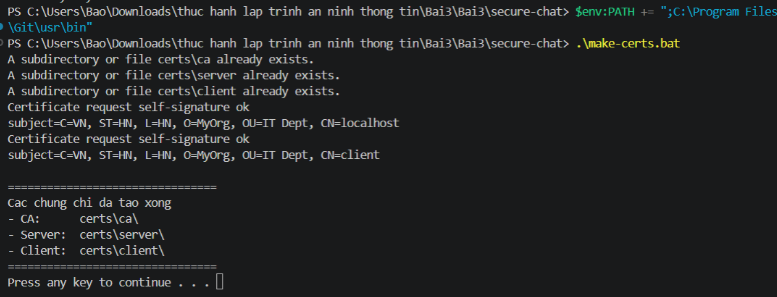
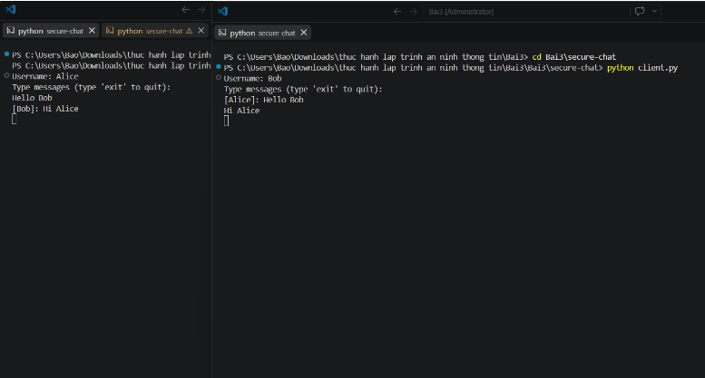
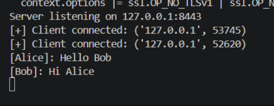
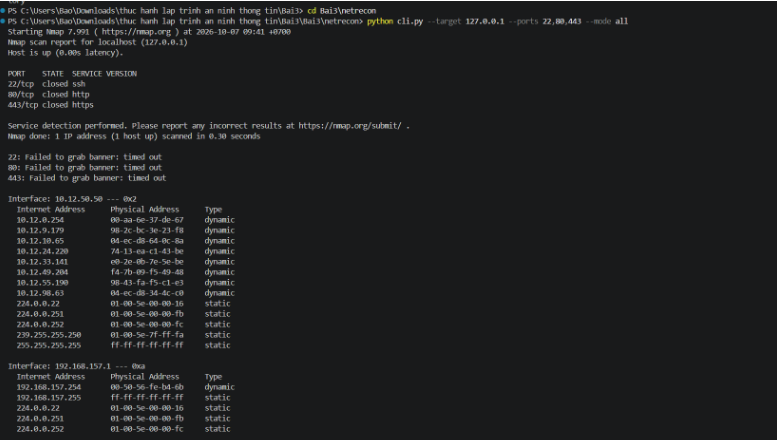
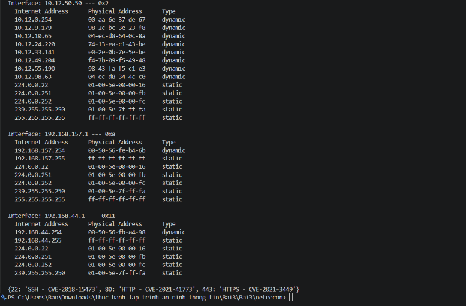
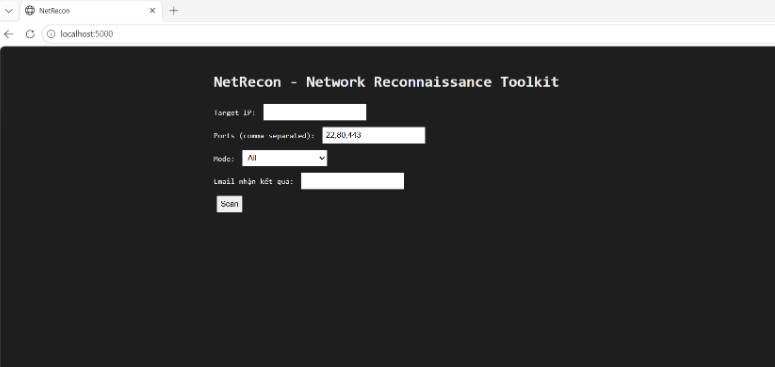
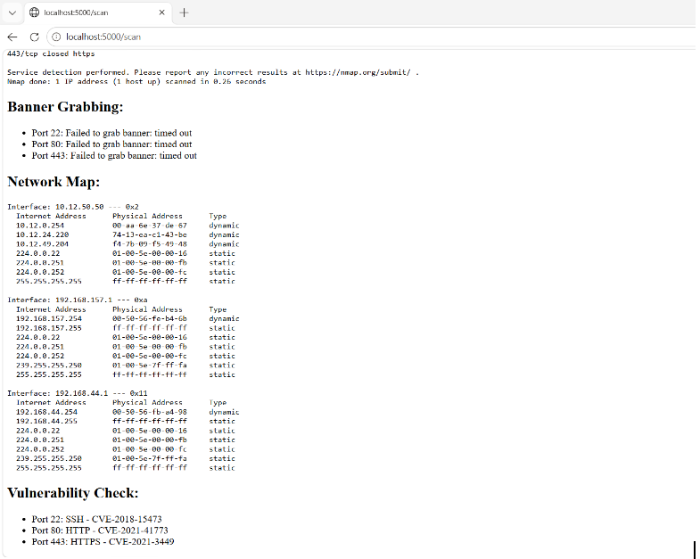
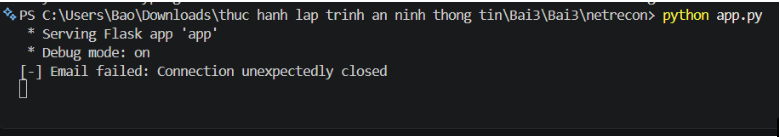

# Báo cáo Thực hành Lập trình An ninh thông tin - Bài 3

Dự án bao gồm 2 phần chính:

1. Ứng dụng Chat bảo mật (`secure-chat`)
2. Công cụ quét mạng (`netrecon`)

---

## PHẦN 1: DỰ ÁN ỨNG DỤNG CHAT BẢO MẬT (SECURE-CHAT)

### Ảnh 1: Khởi tạo chứng chỉ SSL/TLS

**Giải thích:** Kết quả thực thi script `make-certs.bat` để tự động hóa quá trình khởi tạo cấu trúc thư mục CA (Certificate Authority). Script này sử dụng OpenSSL để tạo ra các cặp khóa (Private/Public Key) và chứng chỉ điện tử (Certificates) X.509 cho cả Server và Client. Đây là bước thiết yếu để thiết lập nền tảng bảo mật kết nối mã hóa TLS/SSL, giúp xác thực danh tính của các bên tham gia giao tiếp.

### Ảnh 2,3: Giao diện Chat bảo mật và Log Server

**Giải thích:** Hệ thống chat bảo mật hoạt động thành công. Hai client (Alice và Bob) có thể trao đổi tin nhắn thời gian thực thông qua Socket. Tại màn hình Server, có thể thấy các bản tin truyền đi đều đã được mã hóa mạnh bằng thuật toán **AES-256 (chế độ CBC)**. Nhờ kết hợp giữa mã hóa đầu cuối và đường truyền TLS, ứng dụng đảm bảo tính bảo mật, toàn vẹn dữ liệu và chống lại các cuộc tấn công nghe lén (Eavesdropping / Man-in-the-Middle) trên mạng.

---

## PHẦN 2: DỰ ÁN CÔNG CỤ QUÉT MẠNG (NETRECON)

### Ảnh 4,5: Quét mạng thông qua giao diện dòng lệnh (CLI)

**Giải thích:** Giao diện dòng lệnh (CLI) của NetRecon đang thực thi lệnh thu thập thông tin mục tiêu. Công cụ hoạt động đa luồng (Asyncio), tích hợp Nmap để quét cổng (Port Scanning), dò tìm dịch vụ (Service Detection) và tự động bắt Banner (Banner Grabbing). Bên cạnh đó, tính năng Network Mapping cũng trích xuất thành công bảng ARP để lập bản đồ các thiết bị trong mạng MAC/IP. Đặc biệt, hệ thống đã phát hiện và cảnh báo các lỗ hổng bảo mật (CVE) tương ứng với các cổng dịch vụ đang mở.

### Ảnh 6: Giao diện trang chủ Web NetRecon

**Giải thích:** Giao diện Web (Front-end) của NetRecon được thiết kế trực quan và thân thiện, sử dụng Flask làm Backend. Giao diện cho phép người quản trị mạng dễ dàng cấu hình các tham số như Target IP, Ports, chế độ quét (Mode) và địa chỉ Email nhận báo cáo mà không cần phải thao tác với dòng lệnh phức tạp.

### Ảnh 7: Kết quả trinh sát mạng hiển thị trên Web

**Giải thích:** Kết quả trả về sau quá trình trinh sát mạng (Network Reconnaissance). Dữ liệu thô từ các mô-đun quét được hệ thống Backend phân tích và định dạng lại, hiển thị chi tiết, rõ ràng trên nền tảng Web. Người quản trị có thể dễ dàng theo dõi trạng thái các cổng, thông tin dịch vụ, các giao diện mạng lưới và danh sách các lỗ hổng nguy hiểm (Vulnerability Check) đang tồn tại trên máy chủ mục tiêu.

### Ảnh 8: Ghi nhận ngoại lệ khi gửi Email báo cáo tự động

**Giải thích:** Mặc dù đoạn code tích hợp `smtplib` và giao thức SMTP_SSL đã được viết chuẩn xác, quá trình gửi email tự động đã bị từ chối với thông báo ngoại lệ `[-] Email failed: Connection unexpectedly closed`.

**Nguyên nhân thực tế:** Do chính sách bảo mật khắt khe của hệ thống máy chủ Google (smtp.gmail.com), các ứng dụng bên thứ 3 (như script Python) sẽ bị chặn kết nối (drop connection) nếu tài khoản chưa được thiết lập Xác minh 2 bước (2FA) và cấp "Mật khẩu ứng dụng" (App Password) riêng biệt.

**Đánh giá:** Mặc dù email chưa đến được đích vì rào cản bảo mật của Google, nhưng hệ thống NetRecon vẫn hoạt động ổn định nhờ khối lệnh `try...except`. Chương trình đã chủ động bắt được lỗi (Exception) và in log ra Terminal thay vì làm sập toàn bộ hệ thống Web Server, đảm bảo tính sẵn sàng (Availability) cho ứng dụng.
